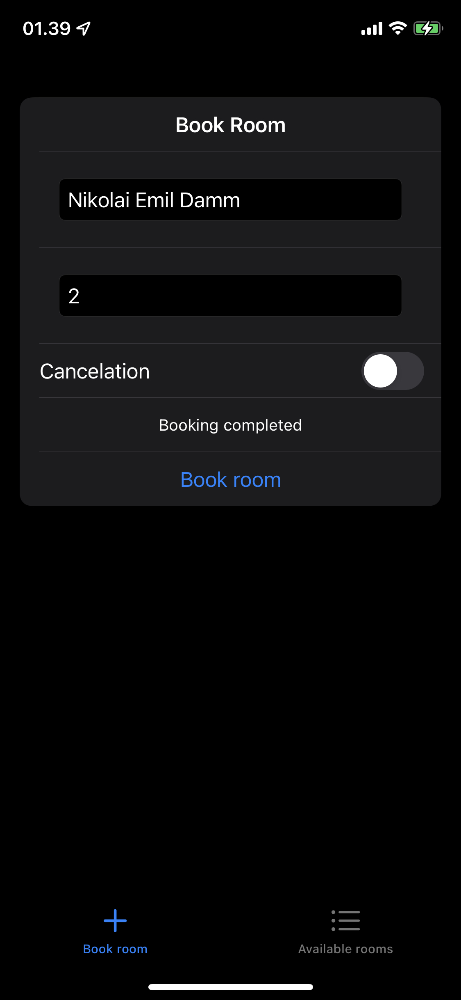
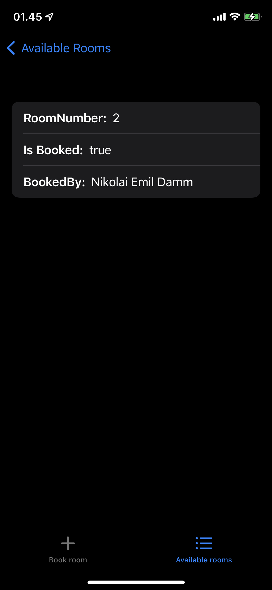

<style>body {text-align: justify}</style>
<p style='text-align: right;'> Written by <i>Nikolai Emil Damm</i> </p>

# Assignment 05 — iOS Booking System

This paper describes a prototype for a booking system with a natural voice interface. The prototype is called *Rooms* and is an iOS App that relies on Apple's virtual assistant Siri as the natural voice interface.

## Prototype motivation and goals

The motivation for creating *Rooms* is first and foremost to present a prototype on how the booking of study rooms on SDU could be improved from a usability perspective by a native iOS app. The choice of specifically using iOS and Siri was a matter of interest. I wanted to gain experience with how one can design and create iOS apps that utilize Siri as a voice interface.

## Prototype design

*Rooms* is designed first as a native iOS App and secondly as a natural voice interface utilizing Siri. In this section, the overall design of the app will be presented.

### **Rooms as an App**

*Rooms* is a simple iOS App consisting of 2 views a Book Room view and an Available Rooms view.

<figure style='text-align: center;'>
    
    <figcaption>Figure 01: The Book Room View and the Available Rooms View</figcaption>
</figure>

The Book Room View allows users to manually book, or cancel a booking of a room by typing in a name, the room number, and whether it is a booking cancellation. If a user tries to book an already booked room or cancel a booking of a not booked room, the app will show an error. An error is also shown if a user tries to cancel a room booking booked by someone else.

The Available Rooms view lists all *Rooms*, where each room can be tapped to see if the room is booked and by whom.

### **Rooms as a natural voice interface**

The next part of the app is *Rooms* natural voice interface utilizing Siri. The *Rooms* application is built with an intents extension that can extend the capabilities of Siri. To understand what this means, one must know what an intent is.

<figure style='text-align: center;'>
    
    <figcaption>Figure 02: How a users request is handled by an intent extension. Taken from <a href="https://developer.apple.com/videos/play/wwdc2020/10073">https://developer.apple.com/videos/play/wwdc2020/10073</a></figcaption>
</figure>

An intent is what Apple calls the actions that Siri can execute. Intents are not restricted to be executed as voice commands with Siri but can also be executed automatically or manually as Shortcuts from different locations in iOS. Intents have a category, name, properties, a response, and optionally they are user-configurable in Shortcuts. The category of an intent defines how Siri understands and responds to users' requests. The properties of an intent define what variables the action has and how Siri should respond if these variables are not set. The response is the data that is accessible when handling the intent in the code that processes the users' requests.

<figure style="float: right">
    
    <figcaption>Figure 03: The BookRoom intent</figcaption>
</figure>

The intent *Rooms* provides is set to be of category "Book", which lets Siri know that we are booking something. The properties are the user's name, what room number the user wants to book, and if it is a cancellation of a booking. Lastly, the response reuses the previously mentioned properties, as these are used to process the intent. See Figure 03 for the data in the BookRoom intent.

Each response contains a list of response templates that describe the different ways that a user's request can end (see Figure 04). Each response template can be configured as an error or not and has a text for a Voice-Only Dialog and a Printed Dialog. These texts define the final response of a completed intent.

<figure style='text-align: center;'>
    
    <figcaption>Figure 04: The success response template for the BookRoom intent.</figcaption>
</figure>

To enable *Rooms* natural voice interface, the user must add the intent to Siri. Adding the intent to Siri is a bit cumbersome as *Rooms* donates the intent to the system, and the user then needs to find the shortcut in the Shortcuts app under "Shortcuts from Your Apps" after having used *Rooms* to make or cancel a booking. Adding an intent as a shortcut enables the user to configure the shortcut to his liking, and in my case, I configured two shortcuts, one for making bookings and one for canceling bookings. Making the differing Shortcuts from the same intent was done by setting the cancellation parameter of the intent by default instead of having Siri ask for a value each time.

<figure style='text-align: center;'>
    
    <figcaption>Figure 05: Adding and configuring <i>Rooms</i> to make bookings and cancel bookings through the Shortcuts app.</figcaption>
</figure>

## Prototype implementation

The most interesting code in this project is the handling of the intents. The IntentHandler file is quite large as it has to handle the intent and resolve any of the parameters used in the intent. Therefore this section will focus on the most critical methods in the flow.

```swift
override func handler(for intent: INIntent) -> Any {
    guard intent is BookRoomIntent else {
        fatalError("Unknown intent type: \(intent)")
    }
    return self
}
```

The handler method is used to filter what kind of intent we want to handle with *Rooms*. Here we throw an error if the intent does not match the BookRoomIntent provided by *Rooms*. Next, we must confirm that the BookRoomIntent is ready to be handled.

```swift
public func confirm(intent: BookRoomIntent,
    completion: @escaping (BookRoomIntentResponse) -> Void) {
    
    completion(BookRoomIntentResponse(code: .ready, userActivity: nil))
}
```

As implied, this method confirms that the intent is ready to be handled and is required before the handling can happen.

```swift
func handle(intent: BookRoomIntent, completion: @escaping (BookRoomIntentResponse) -> Void){
    guard let roomNumber = intent.roomNumber, let bookedBy = intent.bookedBy, let isCancelationOfBooking = intent.isCancelationOfBooking else {
        completion(BookRoomIntentResponse(code: .failure, userActivity: nil))
        return
    }
    
    let result = makeBooking(roomNumber: roomNumber.intValue, bookedBy: bookedBy, isCancelationOfBooking: isCancelationOfBooking.boolValue)
    
    if result {
        if isCancelationOfBooking.boolValue == true {
            completion(BookRoomIntentResponse.successCancelledBooking(roomNumber: roomNumber, bookedBy: bookedBy))
        } else {
            completion(BookRoomIntentResponse.success(roomNumber: roomNumber, bookedBy: bookedBy))
        }
    } else {
        if isCancelationOfBooking.boolValue == true {
            completion(BookRoomIntentResponse.failureCancelledBooking(roomNumber: roomNumber, bookedBy: bookedBy))
        } else {
            completion(BookRoomIntentResponse.failure(roomNumber: roomNumber, bookedBy: bookedBy))
        }
        
    }
}
```

The "handle" method is responsible for actually handling the intent. The method first checks that all the parameters are set, and if not, it will fail. After this, the actual booking is made, and whether it succeeds or fails is saved to the variable "result". Then we check if the result is true or false. If it is true and the "isCancellationOfBooking" boolean is also true, we complete the intent with the .successCancelledBooking response template, or otherwise the .success response template. Likewise, we do the same in cases where the booking fails.

## Prototype examples

As *Rooms* allows its users to add extended Siri capabilities as Shortcuts, the user controls what voice command to use to activate the *Rooms* booking flows. As previously mentioned, I added and configured two Shortcuts to make a booking and cancel bookings.

Each Shortcut follows the same template, so they differ in what they do and how they are activated. To start a booking flow, one would say "Book room with *Rooms*", and to start a cancellation of a booking, one would say "Cancel booking with *Rooms*". Below are conversation snippets of the flow after activating either of the sequences.

<figure style='text-align: center;'>
    
    <figcaption>Figure 06: Conversation snippets and confirmation of booking.</figcaption>
</figure>

## Conclusions

Creating this app, I learned how Apple intends developers to extend Siri's capabilities. I learned that Siri is a very guarded system and that developers are not given much flexibility in the way they can extend and use the features of Siri. Nonetheless, I found this to be an enjoyable approach as the intended way of extending Siri is very streamlined. Even though one might not be able to extend Siri with whole new ways of interpreting sentences, the current possibilities cover many use cases. Adding the intents to Shortcuts optionally seems like an excellent way to let the user decide whether the extended voice commands are something they wish on their phone or not. I found the process a bit cumbersome, however, and I hope I might find a way to prompt the user to add a predefined shortcut instead of requiring the user to find and add the donated ones themselves.
