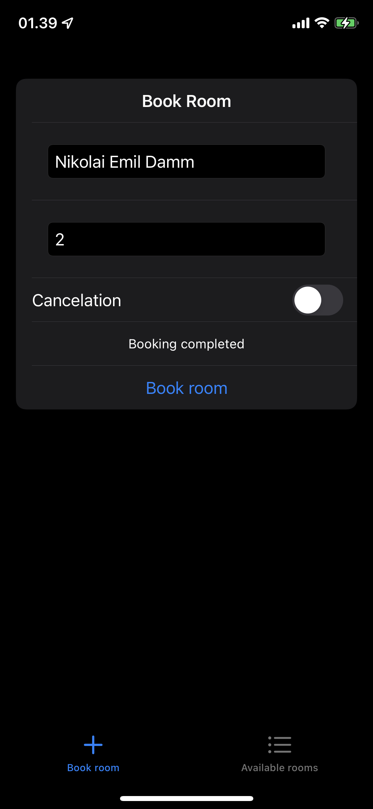
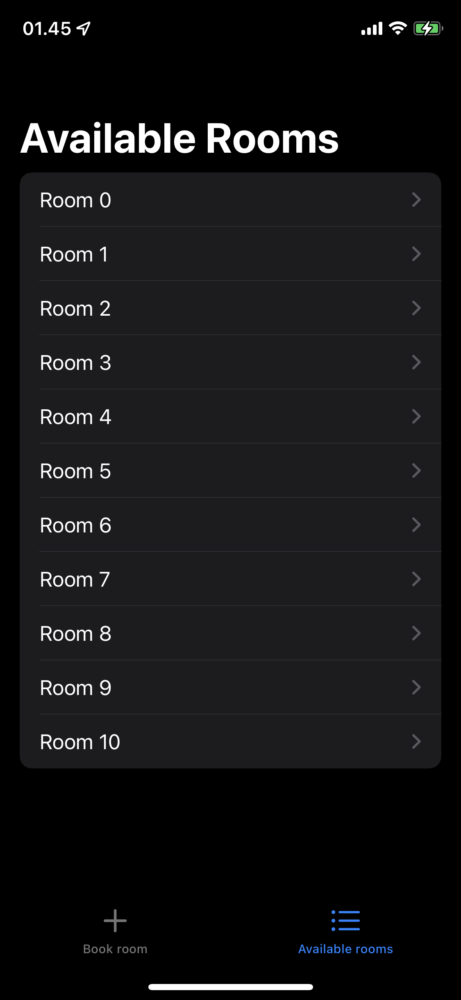
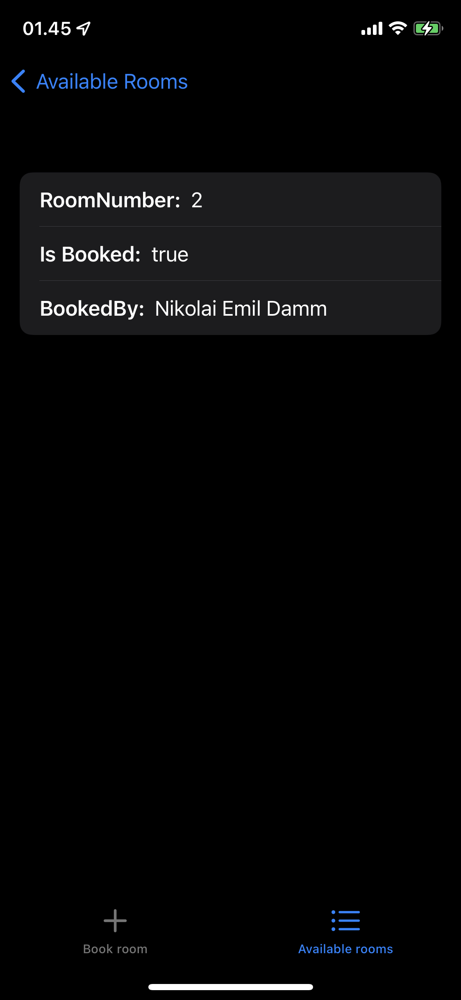

 Written by <i>Nikolai Emil Damm</i> 

# Assignment 05 — iOS Booking System

This paper describes a prototype for a booking system with a natural voice interface. The prototype is called Rooms and is an iOS App that relies on Apple's virtual assistant Siri as the natural voice interface.

In the following sections Rooms will be described. First the motivation and goals behind creating Rooms is presented. Next the design of rooms will be documented, then the implementation will be presented. After that examples of usage will be given e.g. conversation snippets. Lastly a conclusion on what I have learned will be given.

## Prototype motivation and goals

The motivation for creating Rooms is first and foremost to present a prototype on how the booking of rooms on SDU could be improved from a usability perspective by a native iOS app. The choice on specifically using iOS and Siri, was a matter of interest, and because I wanted to gain experience with how one can design and create iOS apps that utilize Siri as a voice interface.

## Prototype design

Rooms is designed first as a native iOS App and secondly as a natural voice interface utilizing Siri. In this section the overall design will be presented. First we will take a look at Rooms when using it without voice commands. Rooms is a simple iOS App consisting of 2 views (1) a Book Room view and (2) an Available Rooms view.

<figure style='text-align: center;'>
    
    <figcaption>Figure 01: Book Room View</figcaption>
</figure>

The Book Room View allows users to manually book, or cancel a booking of a room by typing in a name, the room number, and whether it is a cancellation of a booking. If a user tries to either book a room that is already booked, or cancel a booking of a room that is not booked, or is booked by someone else, the app will show an error. In all simplicity this allows users to book or cancel bookings of 10 abstract rooms.

<figure style='text-align: center;'>
    
    <figcaption>Figure 02: The Available Rooms View</figcaption>
</figure>

The Available Rooms view is a list of all rooms, where each room can be tapped to see if the room is booked and by whom. 

Behind the scenes this implementation relies on AppStorage, which is a simplistic way of saving App Data for an iOS app. All the rooms and their state is saved to AppStorage in an App Group called "group.com.niem94.rooms". Why it is saved to an App Group is explained later, but for now it is just important that is is saved to AppStorage as this enables the app to be closed without deleting the state of the available rooms.

The next part of the app and arguably the more exciting pars is how Rooms enables the natural voice interface utilizing Siri. the Rooms application is built with an intents extension that can extend the capabilities of Siri. 
An intent is what Apple call the actions which Siri is capable of executing. Intents are however not restricted to be executed as voice commands with Siri, but can also be executed automatically or manually as Shortcuts from Widgets, the control centre etc. Intents have a name, properties and optionally shortcuts. The properties of an intent define what variables the action has, such as the name of the user making a booking, what room number the user wants to book etc. Below is the design of the intent provided by Rooms.

To make Siri aware of the intents extension the intents must be added as Shortcuts. Below is a diagram that shows how a users request is handled by a custom intent.

Rooms provides one intent that with the use of properties () can either make a new booking or cancel an existing booking.

- Describe the different technologies used in the design.
- Present a PlantUML diagram
- Describe the diagram

## Prototype implementation (e.g. code snippets)

## Prototype examples (e.g. conversation snippets)

## Conclusions (e.g. what did I learn?)
